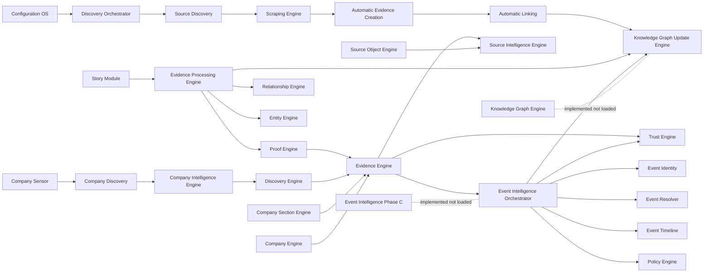

# TSEMOU OS Architecture Audit

Date: 2026-07-06
Scope: codebase audit of currently implemented modules under modules/ and module loading in includes/class-core.php.
Constraint followed: no code changes, one report file only.

## Audit Method
- Module inventory from modules/ directory.
- Runtime loading verification from includes/class-core.php.
- Responsibility and I/O inference from class signatures and docs in docs/.
- Community overlap analysis focused on Ranking, Promotion, Trust, Reputation, Community Feed, Living Case.

## Engine/Module Audit Table

| Engine/Module | Current responsibility | Main classes/files | Inputs | Outputs | Dependencies | Current implementation status | Could support upcoming Community Engine? | Possible overlap (Ranking/Promotion/Trust/Reputation/Community Feed/Living Case) | Recommendation |
|---|---|---|---|---|---|---|---|---|---|
| Configuration OS | Central config loading, discovery wave tasks, fallback data | modules/configuration-os/class-configuration-os.php | JSON config files, option keys | normalized config arrays, tasks | none hard; consumed by Discovery Orchestrator and others | Implemented and loaded | Yes (feed/ranking policy knobs) | Promotion, Ranking (policy source) | Keep as is; extend with community policy keys |
| Discovery Orchestrator | Queue, runtime tick, pipeline execution across engines | modules/discovery-orchestrator/class-discovery-orchestrator.php | queue items, manual/admin triggers | per-item execution results, logs, queue state | Source Discovery, Scraping, Automatic Evidence, Automatic Linking, Evidence Processing, Knowledge Graph Update, Company Discovery | Implemented and loaded | Yes (orchestrate community-item lifecycle to Living Case) | Promotion, Living Case | Extend |
| Source Discovery | Resolve and prioritize candidate sources from task context | modules/source-discovery/class-source-discovery.php; class-source-resolver.php; class-source-prioritizer.php; class-source-queue-builder.php; class-source-registry.php | discovery task (country/industry/topic) | prioritized source payloads/jobs | Configuration OS | Implemented and loaded | Indirectly (for evidence enrichment of community seeds) | none direct; supports Trust/Reputation quality | Keep as is |
| Scraping Engine | Fetch, parse, normalize, and persist raw source records | modules/scraping-engine/class-scraping-engine.php + fetcher/parser/normalizer/storage helpers | source job payload | normalized raw records | Source Discovery outputs | Implemented and loaded | Indirectly | Trust (source quality) | Keep as is |
| Automatic Evidence Creation | Turn normalized raw payloads into evidence drafts/records | modules/automatic-evidence-creation/class-automatic-evidence-creation.php | scraped/normalized payload | evidence draft/object + logs | Scraping Engine | Implemented and loaded | Yes (convert community claims + links into evidence candidates) | Community Feed, Living Case | Extend |
| Automatic Linking | Find company/source/evidence links and push graph updates | modules/automatic-linking/class-automatic-linking.php | payload with entity/evidence hints | link records, graph update trigger | Company Discovery/Company Intelligence, Source Object, Knowledge Graph | Implemented and loaded | Yes | Promotion, Trust, Reputation, Living Case | Extend |
| Entity Engine | Normalize/create entity objects and metadata | modules/entity-engine/class-entity-engine.php | post/entity input | normalized entity refs | Knowledge Graph consumers | Implemented and loaded | Yes | Reputation, Living Case | Keep as is |
| Relationship Engine | Normalize/validate relationship structures and confidence | modules/relationship-engine/class-relationship-engine.php | from/to/type/meta | validated relationship objects | Entity/Graph/Evidence Processing | Implemented and loaded | Yes | Promotion, Trust, Living Case | Keep as is |
| Entity Evidence Links | Store/retrieve evidence-to-entity link sets | modules/entity-evidence-links/class-entity-evidence-links.php | evidence ID, entity ID, relation type | persisted link maps + stats/logs | Evidence Engine, Entity Engine | Implemented and loaded | Yes | Trust, Reputation, Living Case | Keep as is |
| Knowledge Graph (legacy store) | Relationship object store, logs, simple stats | modules/knowledge-graph/class-knowledge-graph.php | relationships | saved relationship arrays + stats | Relationship Engine | Implemented and loaded | Partial | Promotion, Trust, Living Case | Deprecate progressively (favor Knowledge_Graph_Engine + Update_Engine contract) |
| Knowledge Graph Update Engine | Build/validate/commit graph payloads from evidence + relationships | modules/knowledge-graph/class-knowledge-graph-update-engine.php | entities/relationships payload | commit result, validation, graph statistics | Evidence Processing, Relationship Engine | Implemented and loaded | Yes (promotion events, case state transitions as graph edges) | Promotion, Living Case, Reputation | Extend |
| Knowledge Graph Engine (foundation API) | Entity/relation CPT API, graph traversal/health | modules/knowledge-graph/class-knowledge-graph-engine.php | object refs/entity labels | entities, relations, graph views/health | none hard; consumed broadly | Implemented but not loaded in core loader | Yes (best backbone for community case graph) | Promotion, Trust, Reputation, Living Case | Extend and load (or merge with current graph module) |
| Company Discovery | Import/seed/create-update company profiles, duplicate detection, logs | modules/company-discovery/class-company-discovery.php | seed datasets, import JSON, company payload | company records, discovery metadata | Configuration OS, Company Sensor, Company Intelligence | Implemented and loaded | Indirectly (company anchors for community content) | Reputation, Living Case | Keep as is |
| Company Sensor | Batch importer for seed datasets and waves | modules/company-sensor/class-company-sensor.php | seed and batch datasets | imported company records + batch status | Company Discovery | Implemented and loaded | Indirect | none direct | Keep as is |
| Company Section Engine | Company page section payloads (evidence/events/community summary) | modules/company-section-engine/class-company-section-engine.php | company ID | section payload for renderers | Evidence/Events/Related entities | Implemented and loaded | Yes (surface community signals in company context) | Community Feed, Reputation | Extend |
| Evidence Engine | Normalized evidence read API + validation | modules/evidence-engine/class-evidence-engine.php; class-evidence-validator.php | evidence IDs/company IDs | normalized evidence payloads, validation results | Source Intelligence/Source Object, Proof Engine | Implemented and loaded | Yes (community item verification path) | Trust, Promotion, Living Case | Keep as is |
| Evidence Processing Engine | Story -> evidence payload -> relationships -> graph update | modules/evidence-processing-engine/class-evidence-processing-engine.php | story ID/story object | proof materialization, relationships, graph update result | Proof Engine, Entity Engine, Relationship Engine, Knowledge Graph Update Engine | Implemented and loaded (recent integration path present) | Yes (seed-to-case maturation pipeline core) | Promotion, Living Case | Extend |
| Source Intelligence Engine | Domain/source risk and credibility inference | modules/source-intelligence/class-source-intelligence-engine.php | URL/domain | risk levels, warnings, credibility | source registry/config | Implemented and loaded | Yes (trust weighting for community submissions) | Trust, Reputation | Keep as is |
| Discovery Engine | Candidate discovery post type + convert candidate to evidence | modules/discovery-engine/class-discovery-engine.php | URL/title/text candidates | candidate records, evidence creation | Source Intelligence, Company Intelligence | Implemented and loaded | Yes (community feed ingestion endpoint candidate) | Community Feed, Living Case | Extend |
| Source Object Engine | Source object CPT and evidence-source linkage | modules/source-object/class-source-object-engine.php | URL/domain/evidence ID | source object records, evidence attachments | Source Intelligence | Implemented and loaded | Yes | Trust, Reputation | Keep as is |
| Developer Console | Diagnostics for engine presence/data quality | modules/developer-console/class-developer-console.php | admin actions/company id | diagnostics rows and health data | many runtime classes | Implemented and loaded | Yes (operational checks for Community Engine rollout) | none direct | Keep as is |
| Company Intelligence Engine | Canonical identity and matching/detection in text | modules/company-intelligence/class-company-intelligence-engine.php | company ID, free text | identity/match/enrichment results | Company Discovery, Discovery Engine | Implemented and loaded | Yes | Reputation, Community Feed | Keep as is |
| Company Intelligence (report engine) | Company research report scaffolding, logs, stats | modules/company-intelligence/class-company-intelligence.php | company ID, notes/candidate text | report object | Company Intelligence Engine (conceptually) | Implemented and loaded | Indirect | Reputation | Merge with Company Intelligence Engine long-term |
| Policy Engine | Weight and policy registry for scoring/evaluation | modules/policy-engine/class-policy-engine.php | policy keys/groups | weights and decisions | consumed by Trust/Event Intelligence | Implemented and loaded | Yes (community ranking + promotion policy) | Ranking, Promotion, Trust, Reputation | Extend |
| Proof Engine | Proof CPT, evidence profile/intelligence computation and syncing | modules/proof-engine/class-proof-engine.php | story ID, proof payloads, evidence post | proof records, intelligence meta, company sync | Story module, Evidence/Trust flows | Implemented and loaded | Yes | Trust, Reputation, Living Case | Keep as is |
| Event Identity | Event candidate normalization/signatures/matching | modules/event-identity/*.php | story text/candidate structures | identity match candidates/signatures | Story module, Event Resolver | Implemented and loaded | Yes (dedupe community submissions into case identities) | Promotion, Living Case | Extend |
| Event Resolver | Resolve/merge event candidates using similarity/decision | modules/event-resolver/*.php | event candidate + existing records | resolution decision (merge/new/update) | Event Identity | Implemented and loaded | Yes | Promotion, Living Case | Keep as is |
| Event Timeline | Build ordered timeline nodes for resolved events | modules/event-timeline/*.php | resolved event payload | timeline structure/nodes | Event Resolver | Implemented and loaded | Yes | Living Case | Keep as is |
| Event Intelligence Orchestrator | Multi-stage event intelligence (story/evidence/policy/importance/trust/ranking/identity/resolver/timeline/graph) | modules/event-intelligence/*.php | story_id or pipeline state | structured event intelligence result | Story, Evidence Engine, Policy, Trust, Event Identity/Resolver/Timeline, Graph adapter | Implemented and loaded | Yes (core for ranking + promotion to Living Case) | Ranking, Promotion, Trust, Living Case | Extend |
| Story Module | Story CPT/workspace and trigger event identity analysis | modules/story/class-story-module.php | story post save + meta | story workspace data/events | Event Identity, Proof/Evidence flows | Implemented and loaded | Yes (living case container) | Living Case | Keep as is |
| Trust Engine | Company trust computation + community voting shortcodes/moderation | modules/trust-engine/class-trust-engine.php | evidence updates, vote submissions | trust score, community score, moderation outputs | Evidence/Proof meta, Policy | Implemented and loaded | Yes (already has community vote primitives) | Ranking, Trust, Reputation, Community Feed | Extend (do not duplicate vote/reputation logic) |
| Company Engine | Company relationships/timeline/evidence feed/page shortcodes | modules/company-engine/class-company-engine.php | company/file/evidence IDs | company-centric view models and shortcodes | Evidence/Proof/Story | Implemented and loaded | Indirect | Reputation, Living Case | Keep as is |
| Event Intelligence Phase C | Advanced narrative: living story, cross-source, citizen explanation, question building, AI summary | modules/event-intelligence-phase-c/*.php | orchestrated stage input | phase-c enriched story artifacts | Event Intelligence outputs, AI adapter | Implemented but not loaded in core loader | Yes (strong fit for community-to-living-case evolution) | Ranking, Promotion, Trust, Community Feed, Living Case | Extend and integrate into loader/orchestrator when ready |

## Dependency Diagram

## Duplicate Responsibilities (Current Risks)
- Graph layer duplication:
  - modules/knowledge-graph/class-knowledge-graph.php
  - modules/knowledge-graph/class-knowledge-graph-engine.php
  Two graph APIs exist, but only one is currently loaded with update engine bridge. This can split graph contracts.
- Company intelligence duplication:
  - class-company-intelligence-engine.php (identity/matching)
  - class-company-intelligence.php (report flow)
  Similar domain, different abstractions, likely mergeable behind one facade.
- Ranking and trust computation spread:
  - Event story ranking in event-intelligence/class-event-story-ranking-service.php
  - Community score/voting in trust-engine/class-trust-engine.php
  Requires policy-governed ownership boundaries to avoid diverging ranking formulas.
- Evidence transformation spread:
  - discovery-engine candidate->evidence
  - automatic-evidence-creation raw->evidence
  - proof-engine evidence profile/intelligence
  Needs a single canonical evidence lifecycle contract.

## Missing Engines / Capability Gaps
- Community Feed Ingestion Engine (missing):
  - No dedicated module to ingest POST/EVIDENCE/STORY/SOLUTION/QUESTION submissions into a normalized community item schema.
- Community Ranking & Promotion Coordinator (missing as explicit module):
  - Ranking pieces exist, but no explicit engine that promotes community seeds to Living Case with transparent stages.
- Reputation Profile Engine (missing):
  - Trust score exists, but no dedicated actor-level reputation model for contributors (authors, validators, reviewers).
- Moderation Decision Engine (partially present only):
  - Basic moderation page in Trust Engine exists, but no explicit policy-driven moderation workflow engine.
- Case Lifecycle State Engine (missing as explicit owner):
  - Stage labels exist conceptually (seed, rising, living), but no single lifecycle state manager across modules.

## Proposed Community Engine Architecture (Reuse First, No Duplication)

### Design Principle
Implement Community Engine as an orchestration layer over existing engines, not as a parallel stack.

### Recommended Composition
- Community Seed Intake (new thin module, minimal scope):
  - Owns community item schema and submission endpoints only.
  - Immediately delegates:
    - source/domain checks -> Source Intelligence + Source Object Engine
    - company matching -> Company Intelligence Engine
    - event identity dedupe -> Event Identity + Event Resolver
- Community Scoring Adapter (extend existing):
  - Use Trust Engine for community interaction signals (TSEMIT/UNTSEMIT, suspicion checks).
  - Use Event Intelligence ranking output for story/public-importance signals.
  - Use Policy Engine as the single place for weight tuning.
- Promotion Pipeline (extend existing):
  - Use Discovery Orchestrator queue to execute promotion checks.
  - Use Evidence Processing Engine + Proof Engine to materialize verification artifacts.
  - Use Knowledge Graph Update Engine for state transition edges and auditability.
- Living Case Materialization (reuse existing):
  - Story Module remains case container.
  - Event Timeline + Event Intelligence build evolving case context.
  - Company Section Engine / Company Engine render downstream views.

### Suggested Ownership Boundaries
- Ranking formula owner: Event Intelligence ranking service + Policy Engine.
- Trust/reputation owner: Trust Engine (extend with contributor reputation profile tables/meta).
- Promotion owner: Discovery Orchestrator + explicit promotion step definitions in Policy Engine.
- Feed projection owner: new Community Seed Intake module (read model only), not scoring logic.

### Minimal New Additions
- Add one thin Community Seed Intake module.
- Add contributor reputation data model inside Trust Engine (extension, not new parallel trust engine).
- Add policy keys for promotion cadence and thresholds in Policy Engine.
- Integrate Event Intelligence Phase C into loader when ready to improve Living Case narratives.

## Final Recommendations Summary
- Keep: core ingestion, evidence, identity, resolver, timeline, trust baseline, policy, orchestrator.
- Extend: Discovery Orchestrator, Trust Engine, Event Intelligence, Policy Engine, Evidence Processing, Company Section Engine.
- Merge: Company Intelligence pair into a single facade over identity + reporting.
- Replace/Deprecate over time: legacy Knowledge_Graph wrapper in favor of one graph contract with loaded Knowledge_Graph_Engine + Update_Engine.
- Avoid: building a second ranking engine, second trust engine, or separate living-case lifecycle outside existing orchestrator/event stack.
