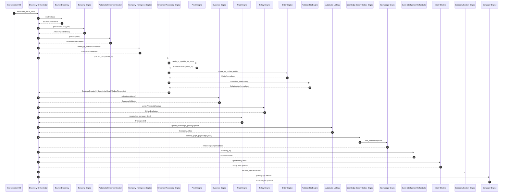

# TSEMOU MVT Orchestration Blueprint

Status: Canonical Phase B Step 2 blueprint
Scope: MVT only, architecture-first, reuse-first

This document composes existing canonical sources and does not replace them:
- docs/ARCHITECTURE.md
- docs/CANONICAL_EVIDENCE_MODEL.md
- docs/DISCOVERY_ORCHESTRATOR_C6_INTEGRATION.md
- docs/EVIDENCE_PROCESSING_ENGINE.md
- docs/STORY_TO_PROOF_INTEGRATION.md
- docs/POLICY_ENGINE.md
- TSEMOU_INFORMATION_LIFECYCLE.md

## 1. MVT Goal
Deliver the smallest production-ready workflow using existing engines only:

Source Discovery
-> Article Collection
-> Evidence Creation
-> Company Linking
-> Knowledge Graph Update
-> Living Case Presentation
-> Functional Public Pages

MVT excludes non-essential capabilities (no gamification, no reputation engine, no AI reasoning layer, no optimization, no microservices, no advanced moderation).

## 2. Engine Responsibility Matrix

Legend:
- Active = loaded by includes/class-core.php
- Inactive = implemented but not loaded

| Engine | Purpose | Inputs | Outputs | Events Produced | Events Consumed | Dependencies |
|---|---|---|---|---|---|---|
| Configuration OS (Active) | Discovery and policy configuration source | Config JSON, admin settings | discovery wave tasks, enabled items | ConfigLoaded | none | WordPress options/files |
| Discovery Orchestrator (Active) | Central queue/runtime coordinator | queue item, manual tick, scheduled tick | executor result, queue state, logs | SourceDiscovered, ArticleImported, EvidenceDraftCreated, CompanyLinked, KnowledgeGraphUpdated, StoryProcessingQueued | StoryProcessingQueued, PromotionEvaluationRequested | Configuration OS, Source Discovery, Scraping Engine, Automatic Evidence Creation, Automatic Linking, Evidence Processing Engine, Knowledge Graph Update Engine, Company Discovery |
| Source Discovery (Active) | Resolve and prioritize source targets | discovery task | source payload list | SourceDiscovered | none | Configuration OS |
| Scraping Engine (Active) | Fetch, parse, normalize article data | source payload/job | normalized raw article record | ArticleImported | SourceDiscovered | Source Discovery |
| Automatic Evidence Creation (Active) | Convert raw article record to evidence draft payload | normalized raw article | evidence draft payload | EvidenceDraftCreated | ArticleImported | Scraping Engine |
| Discovery Engine (Active, parallel admin path) | Manual candidate intake and safe evidence staging | URL/title/text candidate | discovery candidate, pending evidence | CandidateCreated, PendingEvidenceCreated | manual admin actions | Source Intelligence, Company Intelligence Engine |
| Company Discovery (Active) | Company profile import/create/update | company payload, seed data | company records, metadata | CompanyUpserted | CompanySeedImportRequested | Company Sensor, Company Intelligence Engine |
| Company Sensor (Active) | Batch/seed import source | seed and batch datasets | imported company batches | CompanySeedImported | none | Company Discovery |
| Company Intelligence Engine (Active) | Canonical company identity/matching | company id, text | match results, identity profile | CompaniesDetected | EvidenceDraftCreated, ArticleImported | Company Discovery |
| Source Intelligence Engine (Active) | Source credibility baseline | URL/domain | credibility/risk/warnings | SourceProfileResolved | SourceDiscovered, ArticleImported | source registry/config |
| Source Object Engine (Active) | Canonical source object and source-evidence linkage | URL/domain, evidence id | source object record, attached links | SourceObjectLinked | EvidenceCreated | Source Intelligence Engine |
| Evidence Processing Engine (Active) | Story to canonical proof/evidence and relationship orchestration | story id | proof id, normalized evidence payload, relationships, graph payload | EvidenceCreated, EntitiesLinked, TrustUpdateRequested, KnowledgeGraphUpdateRequested | StoryProcessingQueued | Proof Engine, Entity Engine, Relationship Engine, Knowledge Graph Update Engine |
| Proof Engine (Active) | Canonical evidence persistence on tsemou_proof | story id, evidence payload | tsemou_proof record, evidence profile/intelligence | ProofPersisted | EvidenceCreated | WordPress CPT/meta |
| Evidence Engine (Active) | Canonical read/validate API for evidence | evidence id, company id | normalized evidence model, validation result | EvidenceValidated | EvidenceCreated, ProofPersisted | Proof Engine, Source Intelligence Engine |
| Entity Engine (Active) | Normalize/create entities | post/story/entity payload | normalized entity object | EntityNormalized | EvidenceCreated, StoryProcessingQueued | WordPress object/meta data |
| Relationship Engine (Active) | Normalize/validate typed relationships | from/to/type/meta | normalized relationship objects | RelationshipNormalized | EntityNormalized, EvidenceCreated | Entity Engine |
| Entity Evidence Links (Active) | Persist evidence-entity links | evidence id + entity relationships | stored link set | EntityLinked | RelationshipNormalized | Evidence Engine, Entity Engine |
| Automatic Linking (Active) | Link company/source/evidence and trigger graph update | evidence draft payload | link records, graph update request | CompanyLinked, KnowledgeGraphUpdateRequested | EvidenceDraftCreated, CompaniesDetected | Company Intelligence Engine, Source Object Engine, Knowledge Graph |
| Knowledge Graph Update Engine (Active) | Validate/commit graph payload contract | entity + relationships payload | graph commit result + stats | KnowledgeGraphUpdated | KnowledgeGraphUpdateRequested | Relationship Engine, Evidence Processing Engine |
| Knowledge Graph (Active) | Relationship persistence/admin graph context | relationship objects | persisted graph relationships, logs | GraphStateChanged | KnowledgeGraphUpdated | Relationship Engine |
| Event Identity (Active) | Event signature + candidate identity dedupe | story content/candidate | identity matches/signatures | EventIdentityResolved | StorySaved, StoryProcessingQueued | Story Module |
| Event Resolver (Active) | Merge/new/update decision for event candidates | identity result, candidate | resolver decision | EventResolved | EventIdentityResolved | Event Identity |
| Event Timeline (Active) | Ordered timeline from resolved events | resolver payload | timeline nodes/sequence | EventTimelineUpdated | EventResolved | Event Resolver |
| Event Intelligence Orchestrator (Active) | Story-level intelligence stages including ranking/public importance/trust adapters | story id, stage state | intelligence result | PublicImportanceEvaluated, StoryRanked, StoryPromotedCandidate | StorySaved, EvidenceValidated, TrustUpdated | Story Module, Evidence Engine, Policy Engine, Trust Engine, Event Identity/Resolver/Timeline, Event Graph Adapter |
| Policy Engine (Active) | Deterministic weights/threshold governance | policy key/group | weight/threshold decisions | PolicyEvaluated | TrustUpdateRequested, RankingRequested, PromotionEvaluationRequested | WordPress options |
| Trust Engine (Active) | Deterministic trust/community score updates | evidence updates, vote submissions | trust score, community score | TrustUpdated | EvidenceValidated, PolicyEvaluated | Evidence/Proof metadata, Policy Engine |
| Story Module (Active) | Story CPT lifecycle and render anchor for Living Case | story create/update | story state + workspace context | StorySaved, LivingCaseUpdated | StoryPromoted | Event Identity, Event Intelligence Orchestrator |
| Company Section Engine (Active) | Company page section payloads | company id | rendered section payload | CompanySectionsUpdated | KnowledgeGraphUpdated, EvidenceValidated | Evidence/Events/related entities |
| Company Engine (Active) | Company public page and shortcodes | company id | public company page blocks | PublicPagesUpdated | CompanySectionsUpdated, TrustUpdated | Evidence Engine, Proof Engine, Story Module |
| Developer Console (Active) | Diagnostics and runtime visibility | admin diagnostics request | health snapshots | DiagnosticsGenerated | none | runtime classes |
| Company Intelligence (report) (Active) | Report scaffolding around company intelligence | company id/notes | report object + logs | CompanyReportUpdated | CompanyUpserted | Company Intelligence Engine |
| Event Intelligence Phase C (Inactive) | Advanced narrative/citizen explanation/living story analysis | event intelligence state | enriched narrative artifacts | PhaseCStoryBuilt | none in MVT | Event Intelligence outputs |
| Knowledge Graph Engine foundation API (Inactive) | Alternate graph entity/relation API | graph object references | graph entities/relations summary | GraphFoundationUpdated | none in MVT | graph CPT API |

Responsibility rule: each business concern has one owner in MVT. No duplicated scoring, trust, graph-write, or promotion owners.

## 3. End-to-End Orchestration

Canonical MVT order (existing engines only):

1. New source discovered
- Configuration OS provides discovery tasks.
- Discovery Orchestrator executes Source Discovery.
- Event: SourceDiscovered.

2. Article imported
- Discovery Orchestrator executes Scraping Engine.
- Scraping Engine fetches/parses/normalizes raw article data.
- Event: ArticleImported.

3. Evidence generated
- Automatic Evidence Creation builds draft evidence payload.
- Discovery Orchestrator can enqueue StoryProcessingQueued when mapped to a story.
- Evidence Processing Engine processes story and invokes Proof Engine for canonical tsemou_proof materialization.
- Events: EvidenceDraftCreated, EvidenceCreated, ProofPersisted.

4. Companies extracted
- Company Intelligence Engine detects/matches companies from evidence/article text.
- Event: CompaniesDetected.

5. Entities linked
- Entity Engine normalizes entities.
- Relationship Engine normalizes typed relationships.
- Entity Evidence Links persists link sets.
- Automatic Linking adds company/source/evidence connections.
- Events: EntityNormalized, RelationshipNormalized, EntityLinked, CompanyLinked.

6. Trust updated
- Evidence Engine validates canonical evidence shape/quality.
- Trust Engine recalculates trust/community score using Policy Engine weights.
- Event: TrustUpdated.

7. Knowledge graph updated
- Knowledge Graph Update Engine validates and commits graph payload.
- Knowledge Graph persists relationship context.
- Event: KnowledgeGraphUpdated.

8. Story promoted
- Event Intelligence Orchestrator computes public importance + rank.
- Discovery Orchestrator executes promotion evaluation cadence from Policy Engine.
- Event: StoryPromoted.

9. Living Case rendered
- Story Module updates Living Case state.
- Company Section Engine and Company Engine refresh public projections.
- Event: LivingCaseUpdated, PublicPagesUpdated.

## 4. Engine Sequence Diagram

## 5. Event Contracts

| Event | Producer | Consumer | Payload (MVT) | Purpose |
|---|---|---|---|---|
| SourceDiscovered | Source Discovery | Discovery Orchestrator, Scraping Engine | task_id, source_url, source_type, country, industry | Start acquisition for a resolved source |
| ArticleImported | Scraping Engine | Discovery Orchestrator, Automatic Evidence Creation | source_id, raw_id, url, title, content, published_at | Represent normalized article ingestion |
| EvidenceDraftCreated | Automatic Evidence Creation | Discovery Orchestrator, Company Intelligence Engine, Automatic Linking | raw_id, draft_id, title, summary, source_url, candidate_entities | Create deterministic evidence draft contract |
| CompaniesDetected | Company Intelligence Engine | Discovery Orchestrator, Automatic Linking, Evidence Processing Engine | draft_or_story_id, company_ids, confidence_map | Attach company context for linking |
| StoryProcessingQueued | Discovery Orchestrator | Evidence Processing Engine | queue_id, story_id, trigger, priority | Trigger story-to-proof processing branch |
| EvidenceCreated | Evidence Processing Engine | Proof Engine, Evidence Engine, Trust Engine, Knowledge Graph Update Engine | story_id, proof_id, evidence_payload, relationship_payload | Canonical evidence generation complete |
| ProofPersisted | Proof Engine | Evidence Engine, Story Module | proof_id, story_id, status, updated_at | Confirm canonical tsemou_proof persistence |
| EvidenceValidated | Evidence Engine | Trust Engine, Event Intelligence Orchestrator | evidence_id, validation_score, warnings, source_profile | Provide normalized trust-safe evidence result |
| EntityNormalized | Entity Engine | Relationship Engine, Knowledge Graph Update Engine | entity_id, type, external_ref, metadata | Standardize entity contract |
| RelationshipNormalized | Relationship Engine | Entity Evidence Links, Knowledge Graph Update Engine | from_entity, to_entity, rel_type, confidence, meta | Standardize relationship contract |
| EntityLinked | Entity Evidence Links or Automatic Linking | Knowledge Graph Update Engine | evidence_id, entity_id, rel_type, confidence | Persist evidence-entity linkage |
| TrustUpdated | Trust Engine | Event Intelligence Orchestrator, Company Engine | company_id, trust_score, community_score, updated_at | Refresh trust surface for ranking and pages |
| PublicImportanceEvaluated | Event Intelligence Orchestrator | Discovery Orchestrator, Policy Engine | story_id, importance_score, band, reasons | Evaluate societal relevance before promotion |
| StoryPromoted | Event Intelligence Orchestrator and Discovery Orchestrator | Story Module, rendering layer | story_id, rank, promotion_reason, cadence_slot | Move eligible story to Living Case state |
| KnowledgeGraphUpdateRequested | Evidence Processing Engine or Automatic Linking | Knowledge Graph Update Engine | entity, relationships, context | Request deterministic graph commit |
| KnowledgeGraphUpdated | Knowledge Graph Update Engine / Knowledge Graph | Story Module, Company Section Engine, Company Engine | graph_update_id, affected_entities, affected_cases, timestamp | Confirm connected knowledge update |
| LivingCaseUpdated | Story Module | Company Section Engine, Company Engine | story_id, living_case_state, timeline_ref, proof_refs | Update case representation and UI projections |
| PublicPagesUpdated | Company Engine | Public routes/cache layer | company_id, page_fragments, timestamp | Keep public pages functional with latest case data |

## 6. Data Flow (MVT Only)

### Objects created
- tsemou_discovery (manual/optional path via Discovery Engine)
- tsemou_proof (canonical evidence object)
- story (existing case container)
- company (existing company object)
- Source object records (via Source Object Engine when needed)
- Graph relationship records (Knowledge Graph option-based persistence)
- Queue/runtime state objects (Discovery Orchestrator options/runtime storage)

### Objects updated
- story meta (processing state, promotion state, timeline refs)
- tsemou_proof meta (evidence profile/intelligence)
- company trust-related meta and evidence cache pointers
- graph relationship statuses/logs
- orchestrator queue state and logs

### Relationships created
- story -> proof (via related file reference)
- proof/evidence -> company
- proof/evidence -> source
- entity -> entity typed relations
- story/living case -> entities and graph references

### Indexes required (MVT pragmatic)
- WordPress post_type + post_status indexes for story, company, tsemou_proof, tsemou_discovery
- postmeta lookup keys:
  - _tsemou_related_file
  - evidence/source/company linkage meta keys used by Proof/Evidence/Company engines
- Option-key lookups for orchestrator queue/runtime and graph storage buckets

No new database tables are required for MVT.

## 7. Missing Capabilities (MVT Only)

| Capability gap | Classification | MVT decision | Justification |
|---|---|---|---|
| Unified event naming and payload schema across engines | EXTEND | Add deterministic event contract constants/docs in existing engines | Existing engines already exchange equivalent signals but with inconsistent naming |
| Promotion cadence enforcement in orchestrator (1h/2h/4h slots) | EXTEND | Add policy-driven promotion evaluator in Discovery Orchestrator + Policy Engine | Promotion exists conceptually; cadence enforcement is missing |
| Public importance publication gate integration | EXTEND | Wire Event Intelligence public importance result into promotion gate | Existing public importance stage exists in Event Intelligence |
| Story processing trigger bridge from acquisition results | EXTEND | Reuse enqueue_story_processing path in Discovery Orchestrator | Avoids a second orchestrator |
| Graph write path unification | EXTEND | Standardize all graph commits through Knowledge Graph Update Engine | Prevent duplicate graph persistence contracts |
| Functional community feed projection for MVT pages | REUSE | Use existing Story/Company rendering + trust outputs; no new feature set | Required by readiness checklist as minimal projection, not new product layer |
| New standalone community engine | NEW | Not allowed for MVT | Existing architecture can deliver MVT via orchestration-first reuse |

## 8. Backend Readiness Checklist

### Discovery
- [x] Configuration-driven discovery tasks exist
- [x] Source Discovery + Scraping flow exists
- [x] Orchestrator queue/runtime exists
- [ ] Promotion cadence execution rules wired in orchestrator

### Evidence
- [x] Canonical evidence model set to tsemou_proof
- [x] Story to proof integration exists
- [x] Evidence validation API exists
- [ ] Unified event payload schema documented in code constants

### Entities
- [x] Entity normalization exists
- [x] Relationship normalization exists
- [x] Evidence-entity linking exists
- [ ] Single canonical relationship write contract enforced everywhere

### Companies
- [x] Company discovery/import path exists
- [x] Company matching/intelligence exists
- [x] Company public rendering engine exists
- [ ] Company-link confidence thresholds centralized in Policy Engine

### Knowledge Graph
- [x] Graph update engine exists
- [x] Graph persistence exists
- [x] Graph updates are integrated in acquisition/story flows
- [ ] Legacy/alternate graph API boundaries explicitly frozen for MVT

### Living Cases
- [x] Story module exists as living case container
- [x] Event timeline/intelligence components exist
- [ ] Deterministic StoryPromoted gate fully wired via policy + orchestrator

### Community Feed
- [x] Deterministic lifecycle stages defined in TSEMOU_INFORMATION_LIFECYCLE.md
- [x] Trust/community signal primitives exist
- [ ] MVT feed projection contract (read model only) explicitly defined for backend

### Public Pages
- [x] Company page rendering stack exists
- [x] Evidence and trust surfaces exist
- [ ] End-to-end StoryPromoted -> LivingCaseUpdated -> PublicPagesUpdated contract finalized

## 9. MVT Gate

| Capability | Existing Engine | Ready | Needs Extension | New Code Required | Priority |
|---|---|---|---|---|---|
| Source discovery and acquisition runtime | Discovery Orchestrator + Source Discovery + Scraping Engine | Yes | Minor | No | P0 |
| Evidence draft generation | Automatic Evidence Creation | Yes | Minor | No | P0 |
| Canonical evidence persistence | Evidence Processing Engine + Proof Engine | Yes | Minor | No | P0 |
| Company detection/linking | Company Intelligence Engine + Automatic Linking | Yes | Minor | No | P0 |
| Entity/relationship normalization | Entity Engine + Relationship Engine + Entity Evidence Links | Yes | Minor | No | P0 |
| Trust recalculation | Trust Engine + Evidence Engine + Policy Engine | Yes | Yes | No | P1 |
| Knowledge graph update | Knowledge Graph Update Engine + Knowledge Graph | Yes | Yes | No | P0 |
| Public importance and ranking | Event Intelligence Orchestrator + Policy Engine | Partial | Yes | No | P1 |
| Promotion cadence gate | Discovery Orchestrator + Policy Engine | No | Yes | No | P0 |
| Living case state update | Story Module | Partial | Yes | No | P0 |
| Company/public page projection | Company Section Engine + Company Engine | Yes | Minor | No | P0 |
| Community feed minimal backend projection | Reuse Story/Trust/Policy outputs | Partial | Yes | No | P1 |

MVT gate decision:
- Proceed with backend implementation using orchestration-first reuse.
- Required pre-implementation extensions are bounded to existing engines and policy wiring.
- No new standalone engines are required.
